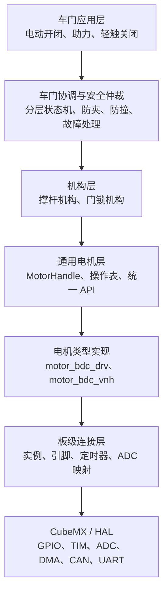

# MotorControl

基于 STM32F407ZGT6 的汽车电动车门控制项目。项目目标是协调一个车门撑杆电机和两个门锁电机，实现车门电动开闭、门锁解锁与吸合，并逐步加入防夹、防撞、手动助力和轻触关闭等功能。

> 当前仓库仍处于底层驱动和电机抽象层建设阶段。本文档中的“规划功能”不代表已经完成或可以直接用于实车安全控制。

## 硬件概况

系统计划控制三个有刷直流电机：

| 执行器 | 驱动方式 | 反馈/输入 | 主要用途 |
| --- | --- | --- | --- |
| 车门内撑杆电机 | DRV8714，双路 PWM | 电流采样、A/B 相霍尔 | 驱动车门开启、关闭和悬停 |
| 解锁/复位电机 | VNH7070AS，PWM + INA + INB | 门锁开关信号 | 门锁解锁及机构复位 |
| 吸合电机 | VNH7070AS，PWM + INA + INB | 门锁开关信号 | 从半锁位置吸合至全锁 |

门锁模块计划接入全锁、半锁、复位和中控四个开关信号，具体有效电平和动作时序将在机构联调阶段确定。

控制板还提供 CAN、LIN、Type-C 串口、I2C、通用数字输入等资源。完整引脚分配和硬件说明见：

- [STM32F407 电机控制板硬件文档 V1.1](STM32F407_%E7%94%B5%E6%9C%BA%E6%8E%A7%E5%88%B6%E6%9D%BF%E7%A1%AC%E4%BB%B6%E6%96%87%E6%A1%A3_V1.1.pdf)
- [CubeMX 工程](MotorControl.ioc)

## 当前实现状态

### 已实现或已有基础

- STM32F407ZGT6 的 CubeMX/HAL 工程和 Keil MDK-ARM 工程。
- GPIO、ADC1、DMA、CAN1、SPI3、TIM1、TIM2、TIM4 和 USART2 的基础配置。
- DRV8714 的 SPI 寄存器访问、故障清除、驱动使能、半桥模式和 PWM 映射配置。
- TIM1 CH1/CH2 双边沿捕获的 A/B 相霍尔软件正交解码，可读取计数、方向和速度。
- ADC1 由定时器同步触发，配合 DMA 环形缓冲区采集 H1 电流；支持原始值、平均值及标定后的电流读取。
- 通用 `motor_driver` 电机句柄、操作表、错误码及控制/查询接口。
- `motor_bdc_drv`：面向 DRV 类双输入有刷电机的实现，通过端口操作接口隔离具体 MCU 和板级资源。
- `motor_bdc_vnh`：面向 VNH 类 PWM + 双方向引脚电机的基础实现。

### 尚未完成

- 三个实际电机的板级实例化和统一初始化。
- 门锁四路开关的完整配置、去抖和时序逻辑。
- 撑杆位置标定、软限位、速度规划和闭环控制。
- 门锁机构的解锁、复位、半锁和吸合状态机。
- 防夹、防撞、堵转判断及故障恢复策略。
- 手动助力和轻触关闭的外力意图识别。
- FreeRTOS 任务、事件和应用状态机。
- CAN/串口应用协议、诊断和状态上报。
- 面向实车的参数标定、故障注入和安全验证。

当前 `main` 完成外设、霍尔解码、DRV8714 和电流采样的基础初始化后进入空循环，尚未运行完整的车门业务逻辑。

## 目标软件架构

项目计划采用分层设计，使硬件变化、电机驱动差异和车门业务逻辑相互隔离：



### HAL 与外设层

由 CubeMX 维护时钟树、GPIO、定时器、ADC、DMA 和通信外设。该层只负责外设初始化、数据采集及中断转发，不包含“开门”“防夹”等业务语义。

### 板级连接层

负责把具体 PCB 资源绑定到电机和传感器实例，例如将 PWM 通道、GPIO、霍尔计数和电流读取回调绑定到撑杆电机。更换控制板或调整引脚时，应主要修改 CubeMX 配置和本层。

### 通用电机层

`motor_driver` 为上层提供统一接口。当前输出量统一为 `0~1000`，它表示驱动输出请求，而不等同于实际闭环速度。测量位置、速度、电流等能力由具体电机实现按硬件条件提供。

### 机构层

机构层将一个或多个电机、传感器组合为具有业务含义的设备：

- 撑杆机构负责目标方向/位置、速度规划、软限位、堵转和负载判断。
- 门锁机构负责协调两个门锁电机及四路开关，向上提供解锁、复位、吸合及锁状态查询。

应用层不应直接拼接门锁 GPIO 时序，也不应直接依赖 DRV8714 或 VNH 的硬件细节。

### 车门应用与安全层

顶层协调门锁机构和撑杆机构，组织完整开门、关门及异常恢复流程。安全仲裁应具有高于普通运动命令的优先级，统一处理过流、堵转、防夹、防撞和紧急停止。

建议后续将门体运动、门锁机构和顶层协调分别建模为状态机，避免形成一个同时处理所有电机、开关和超时的巨大状态机。

## 计划功能流程

### 电动开门

1. 检查供电、位置、门锁和故障状态。
2. 请求门锁机构解锁并等待确认。
3. 驱动撑杆向开门方向运动。
4. 接近目标位置时减速。
5. 到位后停止或进入悬停状态。

### 电动关门

1. 驱动撑杆向关门方向运动，并持续执行防夹判断。
2. 接近锁扣区域时降速。
3. 检测半锁状态后停止撑杆主动关门。
4. 请求吸合电机动作。
5. 确认全锁，并按门锁机构要求执行复位。

### 防夹与防撞

关门方向的异常阻力按防夹处理，开门方向的异常阻力按防撞处理。判断不能只依赖单一固定电流阈值，应综合电流、速度、位置、输出请求、持续时间及所在运动区域，避免把锁扣区域的正常负载误判为障碍物。

### 手动助力与轻触关闭

两项功能都依赖外力意图识别。计划在电机未主动驱动时，根据霍尔方向、位移、速度、持续时间和负载变化判断用户推动方向；确认意图后再平滑增加助力输出。轻触关闭还需要位置范围、门锁状态和防误触条件。

## FreeRTOS 规划

本项目尚未引入 FreeRTOS。后续倾向采用少量职责清晰的任务，而不是为每个电机单独创建任务：

- 车门控制任务：周期执行状态机、运动控制和安全仲裁。
- 传感器处理任务：处理电流、霍尔、开关去抖和状态融合。
- 通信任务：处理 CAN/UART 命令、响应及状态上报。
- 诊断任务：低频执行故障记录、运行统计和健康检查。

中断服务程序只采集数据、记录时间戳或通知任务，不在中断中执行门锁时序和车门业务状态机。所有运动请求最终由车门控制任务统一仲裁，避免多个任务同时直接控制同一电机。

## 目录结构

```text
MotorControl/
├── Core/
│   ├── Inc/                 # 应用与驱动头文件
│   └── Src/                 # HAL 初始化、电机驱动及传感器实现
├── Drivers/                 # STM32 HAL、CMSIS
├── MDK-ARM/                 # Keil MDK-ARM 工程
├── MotorControl.ioc         # STM32CubeMX 配置
└── STM32F407_电机控制板硬件文档_V1.1.pdf
```

当前主要模块：

| 模块 | 说明 |
| --- | --- |
| `motor_driver` | 通用电机句柄、操作表和公开 API |
| `motor_bdc_drv` | DRV 类双 PWM/双输入有刷电机实现 |
| `motor_bdc_vnh` | VNH 类 PWM + INA + INB 电机实现 |
| `drv8714` | DRV8714 SPI 寄存器及半桥配置 |
| `quad_encoder` | A/B 相霍尔正交解码、计数和速度测量 |
| `current_sense` | 定时器同步 ADC + DMA 电流采样与标定 |

## 构建与配置

### Keil MDK-ARM

使用 Keil MDK-ARM 打开 `MDK-ARM/MotorControl.uvprojx`，选择 `MotorControl` 目标后编译。目标芯片为 STM32F407ZGTx。

### STM32CubeMX

使用 STM32CubeMX 打开 `MotorControl.ioc` 修改引脚或外设配置。重新生成代码时应保留用户代码，并检查自定义模块是否仍包含在 Keil 工程中。

## 开发约定与安全注意事项

- CubeMX 生成文件中的自定义内容只放在 `USER CODE` 区域；独立驱动和业务模块使用单独文件维护。
- 应用层通过机构接口或通用电机接口控制设备，不直接操作 HAL、GPIO 或定时器寄存器。
- 将“驱动输出”和“实际速度”作为不同物理量处理。
- 所有运动动作必须具备超时、停止路径和故障返回，不允许无限等待某个开关信号。
- 电流阈值、软限位、回退距离和门锁超时均应作为可标定参数管理。
- 增量霍尔在掉电后无法保留绝对位置；实车运行前必须设计可靠的上电位置恢复或寻零策略。
- 在台架验证完成前，不应将当前固件用于无人监护或可能造成人身伤害的车门运动。

## 建议的后续开发顺序

1. 核对原理图、DRV8714 SPI 时序、电机方向及所有开关有效电平。
2. 完成三个电机的板级连接和实例化，并验证独立启停、方向和紧急停止。
3. 标定霍尔位置、电流零点、电流比例和正常运行负载曲线。
4. 实现门锁机构状态机及所有动作超时。
5. 实现撑杆机构的位置、速度规划、软限位和堵转检测。
6. 实现顶层开门/关门协调状态机。
7. 在基础动作稳定后加入防夹、防撞、手动助力和轻触关闭。
8. 最后接入 FreeRTOS、通信协议、诊断及系统级安全测试。

